# VGM Credits Parser

Shiny app written in R that assists with parsing track credits of music albums, particularly video game music.

### Features

* Modular and extensible parser for many common credits formats
* Web integration to retrieve album data from VGMdb
* Integrated text editor - adjust track credits and see detected and parsed information in real-time
* Automatic mapping from artist roles to vorbis tags
* Numerous options for tag normalization and customization
* Automatic `ARTIST` and `ALBUMARTIST` calculation based on user-defined rules
* Full tag export as `.tsv` file or Mp3tag / foobar2000 compatible data plus format strings
* Integrated tagger for FLAC files (requires metaflac)

## Requirements

### System Requirements

* **R** ≥ 4.0
* **Operating System**: Windows or Linux

### R Package Dependencies

The following R packages will be automatically installed on first run:

* data.table, httr, xml2, stringi, stringdist, memoise, shiny, shinyAce, DT, sortable, bslib, bsicons
* rstudioapi (if running in RStudio)
* magick (Windows only)

### Optional Dependencies

* **metaflac** (part of FLAC tools) - Required for direct FLAC file tagging
* **imagemagick** (Linux only) - For cover art processing

## Installation

### Windows

1. Download and install R from [CRAN](https://cran.r-project.org/bin/windows/base/)
2. Change the path to your R installation inside the `run_app.bat` script
3. Execute the script `run_app.bat` to start the app
   * **Note**: The first startup can take a while as the script downloads and installs all needed R packages from CRAN
4. **Optional**: Download FLAC tools from [xiph.org](https://xiph.org/flac/download.html) and place `metaflac.exe` and `libFLAC.dll` inside the `./tools` folder

### Linux

1. Install R on your system via the package manager: `r-base`
2. Execute the script `run_app.sh` to start the app
   * **Note**: The first startup can take a while as the script downloads and installs all needed R packages from CRAN
3. **Optional**: Install `flac` and `imagemagick` packages via the package manager to fully use the file tagger functionality

## Gallery

Expand section to view screenshots.

### VGMdb Integration

*Retrieve album data directly from VGMdb - here via local HTML file.*

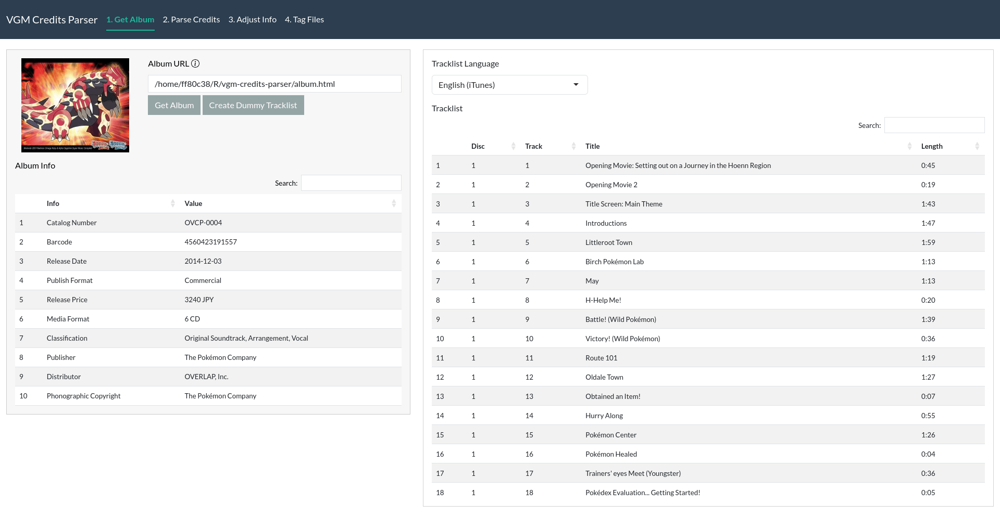

### Interactive Text Editor

*Real-time parsing feedback and result overview as you edit credits.*

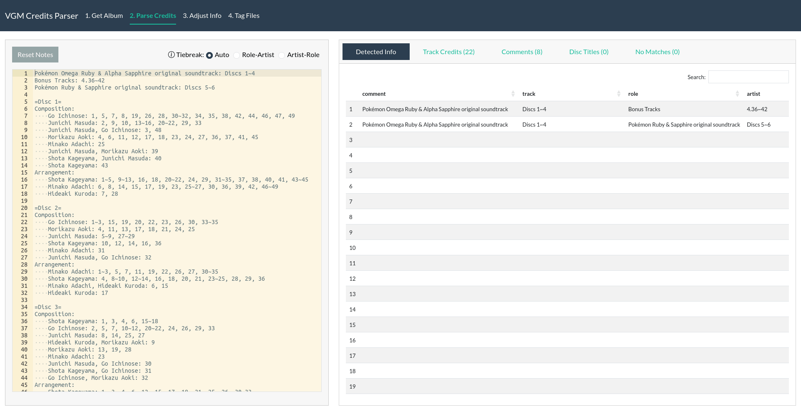
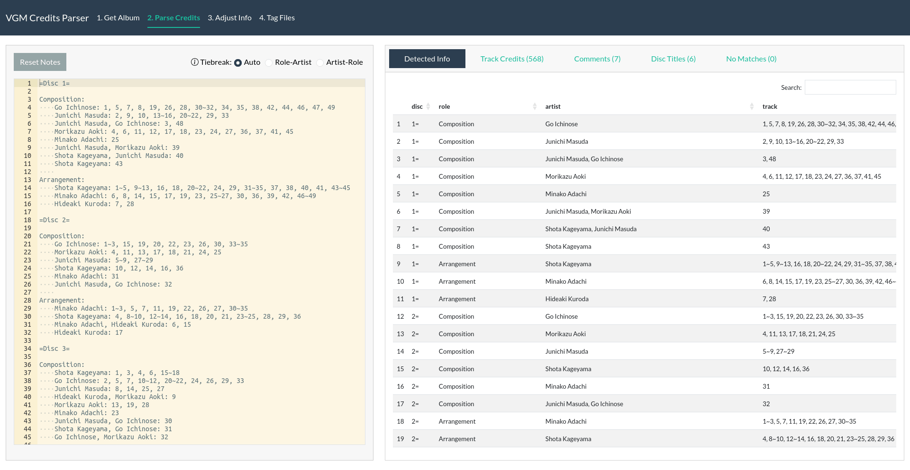
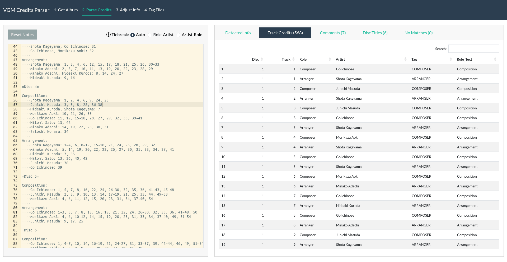
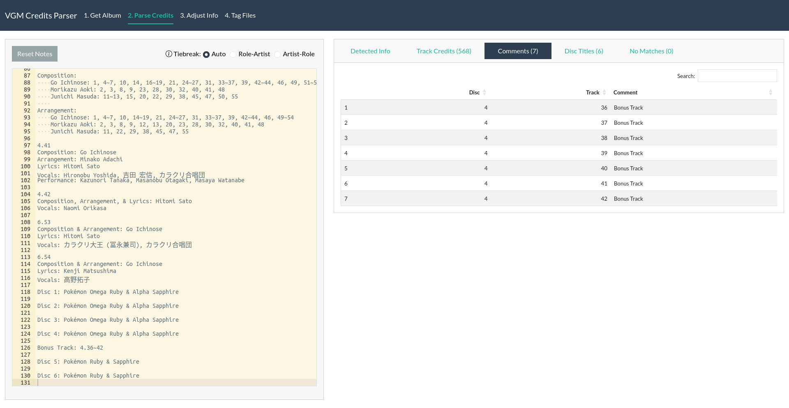
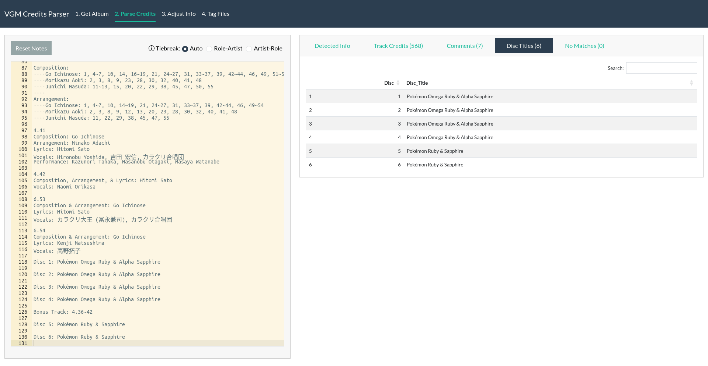

### Tag Configuration and Normalization

*Extensive options for tag standardization and styling, including automatic ARTIST and ALBUMARTIST calculation.*

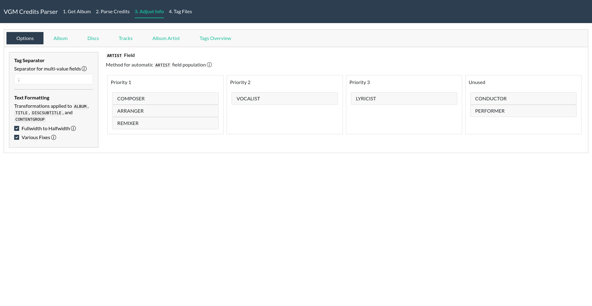
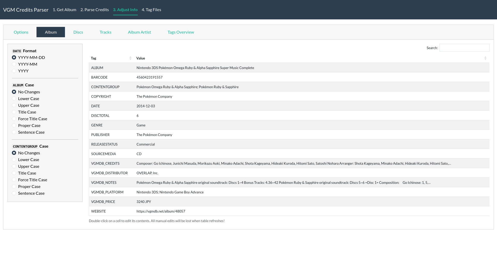
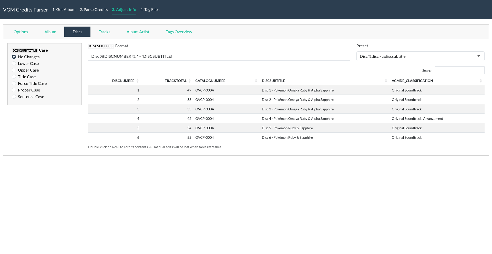
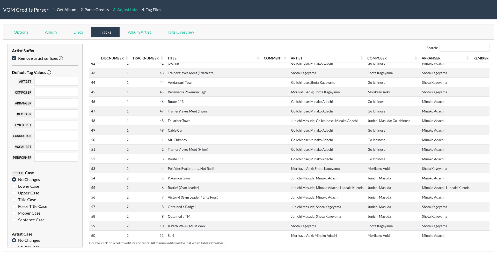
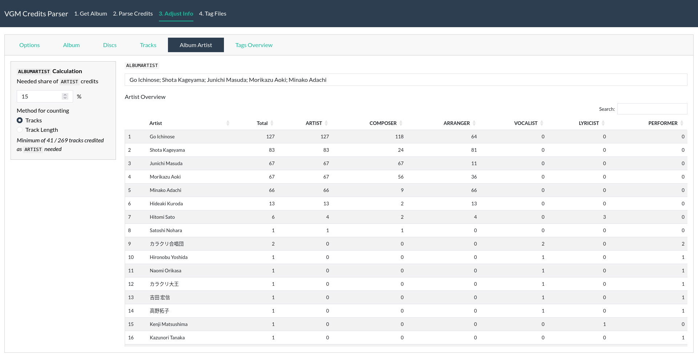

### Tag Overview, Export, and FLAC File Tagging

*Review all tags before export or directly tag your FLAC files.*

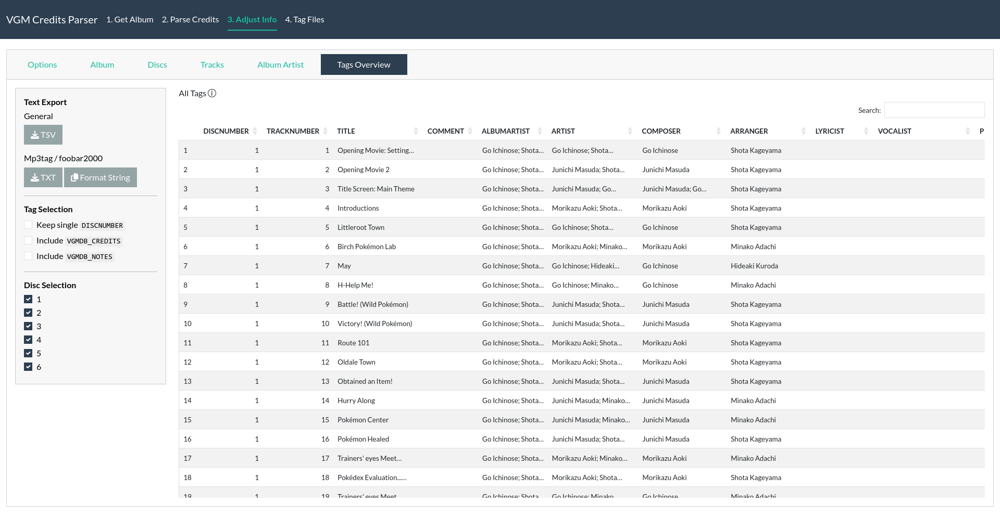
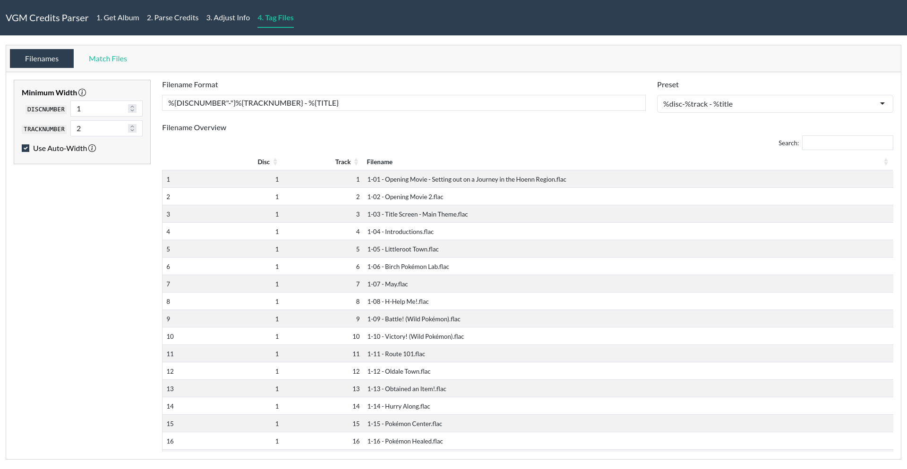
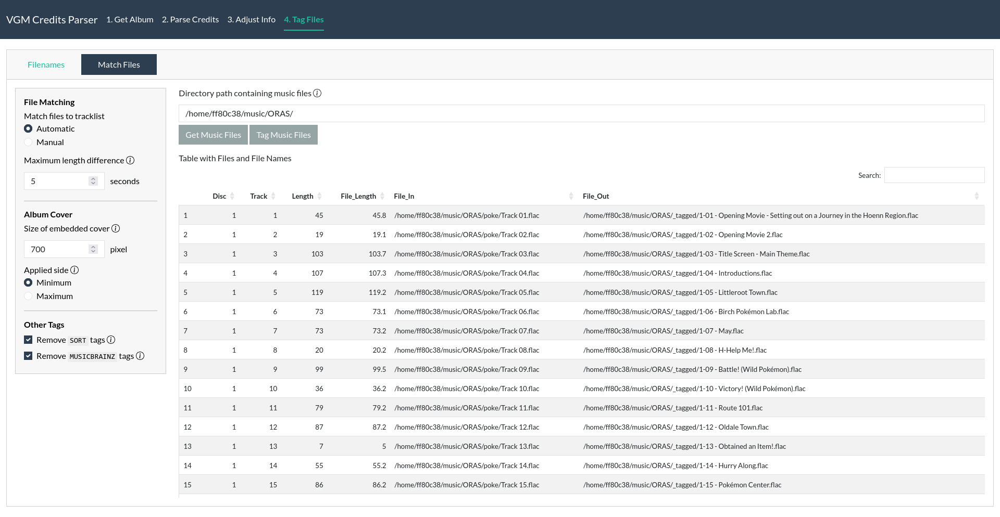

## Usage

Launch the app by running the script `run_app.bat` or `run_app.sh`. This will start an R server as a background process and open a new tab inside your default web browser with the Shiny app. The R server and app will automatically stop when the browser tab is closed or refreshed.

### General Workflow

1. Retrieve album data from VGMdb or alternatively, create a dummy tracklist with the correct number of discs and tracks
2. Revise the track credits inside the text editor to bring them into one of the many supported formats. This usually consists of adding linebreaks to structure the credits into logical pre-defined blocks, removing unnecessary info, explicitly adding info, and fine-tuning existing info
3. Check the automatically detected and parsed information in the live preview and continue modifying the credits until the results are satisfactory
4. Use the many tag standardization and styling options to finalize all tag information. While it is possible to manually change every field of all tracks inside the app, it was not designed for that. Use the general styling options the app provides and use other tools to clean up the rest if needed
5. Either export the finalized tags as a general `.tsv` file or data compatible with Mp3tag and foobar2000
6. Either tag your FLAC files via the metaflac integration or the exported tag data inside an external program

## Documentation

* **[Block Format Reference](docs/BLOCKS.md)** - Supported credit block formats
* **[Configuration Guide](docs/CONFIG.md)** - Customize parsing behavior and appearance
* **[Vorbis Tags](docs/VORBIS_TAGS.md)** - Supported vorbis tags and their mappings
* **[VGMdb Data](docs/VGMDB_DATA.md)** - Artist role mappings and data sources
* **[FLAC Tagging Setup](docs/TOOLS.md)** - Installing metaflac for direct file tagging

## Acknowledgement

[VGMdb](https://vgmdb.net/) is an exceptional resource for video game music information. I would like to express my sincere gratitude to the site, its many contributors, and the community as a whole for maintaining such an invaluable database.

This project would not exist without VGMdb. The app also interacts with the site as part of its core functionality, and internally uses and relies on data directly sourced from VGMdb to function properly.

## Contributing

Contributions of all sorts are welcome. Stay respectful and inclusive. By contributing, you agree that your contributions will be licensed under the MIT License.

## License

This project is licensed under the MIT License - see the [LICENSE](LICENSE) file for details.

### Dependencies

This application depends on various R packages that are distributed under their own licenses. Please review the licenses of the dependencies listed in the Requirements section above.